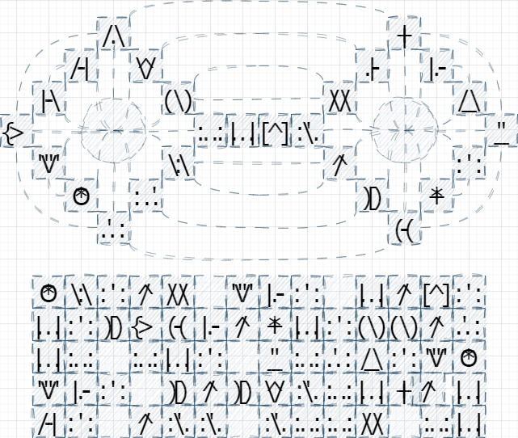
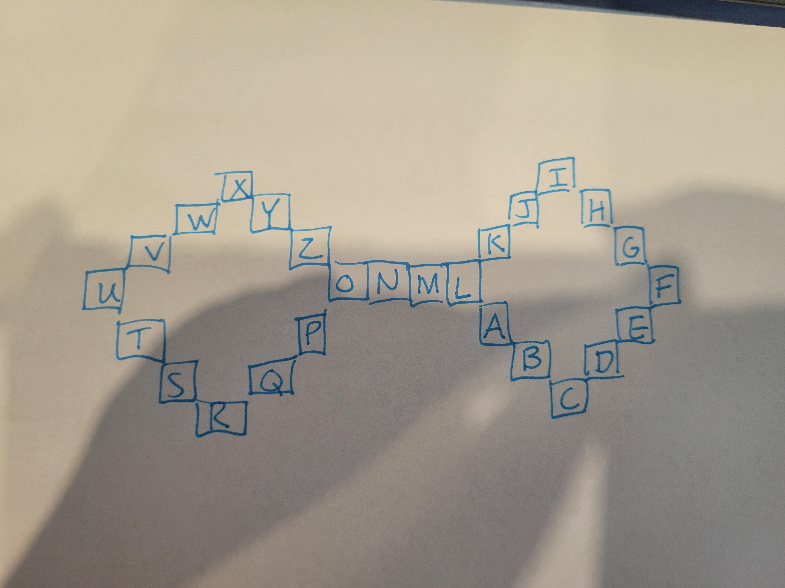

# Crypto 100-3 - For All the World to See

## Challenge Description
In an ancient Babylonian city, archaeologists are busy working to uncover an ancient palace complex. Along the way they discover a stone outhouse. Curiously, the two-seats are adorned with carved figures that could be some form of language, and the base has several lines of similar figures. I have provided a copy of the sketches taken by those present for the discovery. At the bottom of the outhouse they uncover an ancient VeraCrypt container, which no doubt holds the secrets of the former inhabitant of this ancient palace.

Right Click, Save As... [An Ancient VeraCrypt Container](https://pointeroverflowctf.com/static/Crypto100-3)

MD5 checksum E090EAC2DC961FBE98CAC79431AAD6C3

## Solution
I took a [frequency analysis approach](https://en.wikipedia.org/wiki/Frequency_analysis) to start off decrypting this cipher as I noticed a few symbols were repeated a lot throughout the ciphertext, and it looked like a substitution cipher. I chose E as the first option to replace the symbol that was four dots and an apostraphe in the middle and built out from there using [this information](https://pi.math.cornell.edu/~mec/2003-2004/cryptography/subs/frequencies.html) on the frequency of English letters. I eventually was able to decrypt the rest of the shape on the top in relation to the English alphabet, as well as narrowing down many letters by using [wordtips](https://word.tips/) to find "Nebuchadnezzar" for the second line.

The decrypted text was:
>"Speak the name Nebuchadnezzer no one forgets the Babylonian we all look on"

Entering **Nebuchadnezzar** for the VeraCrypt password reveals the flag in a txt file.

## Flag
`poctf{uwsp_c0n57ruc75_0f_d00m}`