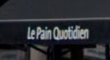

# OSINT 100-1 - Who Can It Be Now

## Challenge Description
A trip through time through the power of open-source intelligence! Start by finding the location in this image: 

Boy, I bet it's changed a lot in a century or so. You should find out. If you do, you'll see a business on the corner with a rustic chic style. Convert the words on the awning closet to the intersection into a flag using the alphabet in the rules and accept your daily bread. (i.e. poctf{uwsp_ _ _ })

## Solution
This one was a straightforward approach with reverse-searching the image on Google. The results brought a photo of [10 Fifth Avenue, Manhattan, New York](https://www.villagepreservation.org/2024/10/31/becoming-fifth-avenue-the-brevoorts/), which is at the intersection of 8th Street and 5th Avenue in Manhattan. The building on the north-west corner of the intersection looks like the same building in the original photo.

Zooming in to the closest awning, "Le Pain Quotidien" is the name of the restaurant on the corner. Converting the name to the flag's accepted alphabet from the CTF's rules gives the flag.

## Flag
`poctf{uwsp_l3_p41n_qu071d13n}`