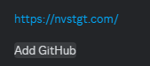

# OSINT 100-3 - Seen and Then Forgotten

## Challenge Description
I really had to commit to pull this one off. That's right - your subject on this one is me, Prof. Johnson. However, I'd really rather not have all of you phish my dentist for my patient records and such, so I'll tell you that your trail starts on Discord and you will find the flag out on the public Internet - no stalking, social engineering, or blackmail required! That's good news for both of us! Mostly me!

## Solution
As the challenge mentioned, I started off with checking Prof. Johnson's discord profile, and I found this section in his "About Me" section, with "Add GitHub" hidden in a spoiler tag.

The hidden "Add GitHub" lines up with the hint of "I really had to commit to pull this one off" in the challenge text (a reference to commits and pull requests in Git). Originally, I searched for his public GitHub accounts, which led nowhere. Then, I looked at the website link above the "Add GitHub" text. I did not find anything specific on that website, but then I thought, what if the GitHub account was "nvstgt?" [An account](https://github.com/nvstgt) did exist under that username and the professor's name, and the [pointeroverflowctf](https://github.com/nvstgt/pointeroverflowctf/blob/main/Telegram/log.txt) repository contained a file with the flag hidden in the logs.

## Flag
`poctf{uwsp_5p34k_fr13nd_4nd_3n73r}`