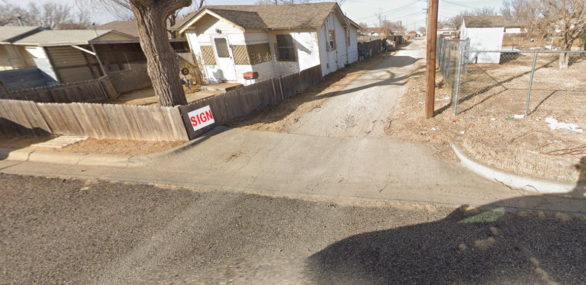

# OSINT 200-1 - Something to Say About It

## Challenge Description
I have a dynamite idea! Let's go on a little snake hunt. Now, where do you find snakes? That's right, in snake pits! How do you find snake pits? By following the clearly marked signs to the designated snake dumping pit locations, of course! Surely you've seen those around your city, right? They probably look a little like this one:

I'll even give you a little help by zooming out a little. You're not xanthophobic, are you?

You know, while we're here, I'm going to grab a fresh password for the archive that contains the flag. As a memento to remember our hunting expedition. The phone number on the sign back there should do. Numbers only, no parenthesis, no spaces, no dashes.

Right Click, Save As... [There's a Snake In My Boot](https://pointeroverflowctf.com/static/OSINT200-1_flag.zip)

MD5 checksum B0752B12B005DC132CA4BA2C90F06629

## Solution
Using google's reverse search didn't bring any conclusive thoughts at the time, so I went off of my knowledge of places that were dry and yellow (a hint from the challenge text - xanthophobia is the fear of the colour yellow). Via the second image, I saw the label of "NW 3rd Ave" on the street, which narrowed my brainstorming to the USA as that street format is typically used in the USA.

My first thought was areas like Nevada, Texas, and Arizona which I knew to be dry/desert-like in some areas. I searched for the street in Nevada, Texas, and Arizona, and eventually came across the street in Amarillo, Texas. I used street view on the street which eventually brought me to the same house shown in the second picture with the snake pit sign.

The sign was on the fence as shown in the third picture:

This means password is **8063407320**. Opening the zip file with the password reveals the flag.

## Flag
`poctf{uwsp_f07r7un3_f4v0r5_7h3_b01d}`