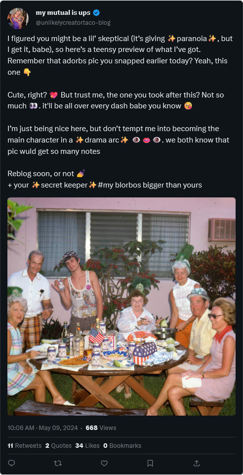

# OSINT 300-2 - Down Like This

## Challenge Description
You don't get to where I am without making a few enemies. I've had to climb over a lot of heads to reach the mountaintop. I'm referring, of course, to my 2021 win at the $2,500 No-Limit Deuce to Seven Draw Tournament at the World Series of Poker in Vegas. So yeah, I'm pretty good at poker.

Well, when people can't take you down a peg or two at the table, they're going to try to get you another way. That's me, though. It's the only way they'll get me, because I know when to hold'em and when to fold'em. So I wasn't surprised when I saw this message posted at me. No idea who this person is, but this pic is from the last 4th of July BBQ. That's me and the missus right there.

To be honest, I don't remember much about this day after this picture was taken. The Tito's was a-flowing and I had a couple-three mocktails on top of that. All I know is I checked my camera roll the next morning, and let's just say if there's even a chance that this person has any of the other pics then I'm scared. They might be airballing, but I can't go all in on that.

Get out there and prove this donkey's just clicking buttons with this bluff.

NOTE: Photo credit goes to David LaChapelle Recollections in America. CBIR will not help you.

## Solution
This OSINT was my first foray into researching something without reverse-searching. I was stumped when I first saw this challenge because, what do I do when I can't reverse-search?

I returned to the challenge a little later and realized there was probably a hint with the text pattern for the tweet. It reminded me of the upsurge in the use of emojis recently on comments for sites like Instagram and YouTube, but at the time, I didn't know the original source of this use of emojis.

The text showed more hints beyond the emojis, however, as terms like dash (i.e., dashboard), reblog, secret keeper, and blorbos. Blorbos and secret keeper were reminiscent of fandom culture when I googled them, often used in pop culture fandoms. Terms like dash and reblog hinted towards blog-style websites, which the only one I could think of was Tumblr when combining the fandom aspect of it.

The username of the Twitter account's handle was also reminiscent of a typical format for a Tumblr blog, so I searched for the blog in Tumblr using the twitter handle. The result brought one blog at https://www.tumblr.com/unlikelycreatortaco-blog/, which contained the flag in a post!

## Flag
`poctf{uwsp_50m37h1n6_w1ck3d_7h15_w4y}`