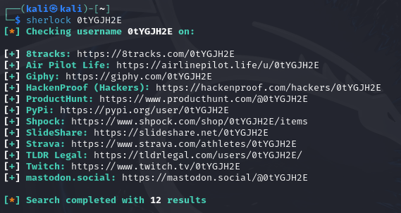
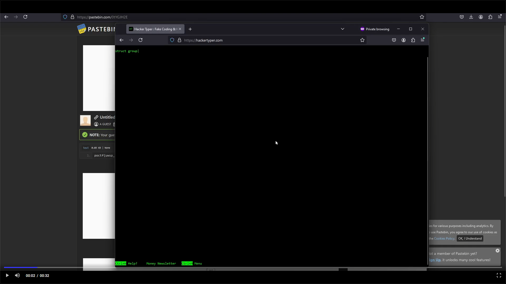
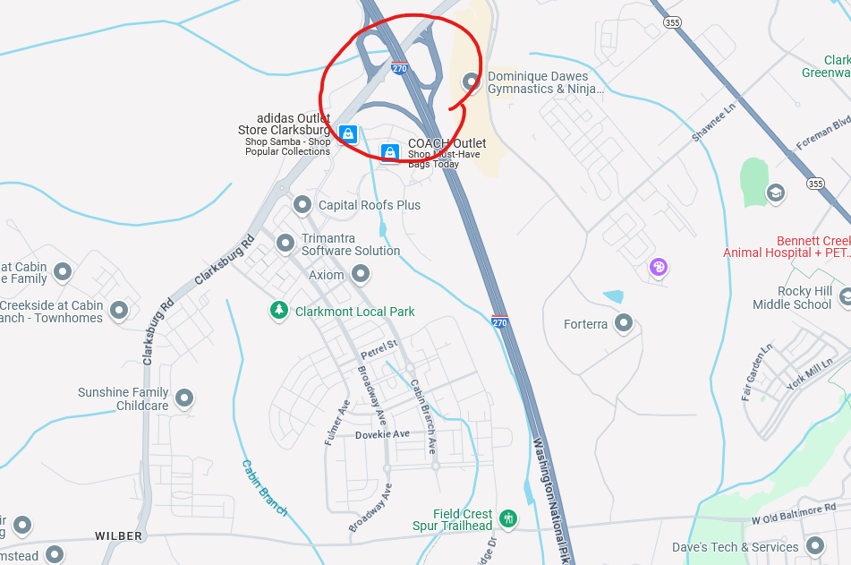
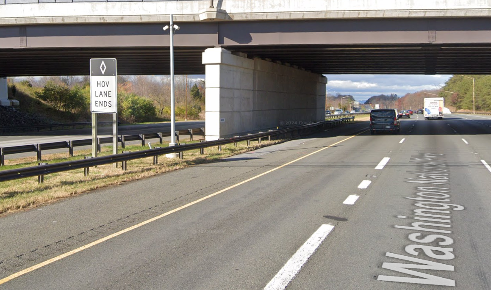

# OSINT 300-1 Intimidation by Echolocation

## Challenge Description
Your objective for this challenge will be in three parts.

Part 1 - Find the user. Do not contact anyone regarding this challenge, as there may be legitimate users with this moniker (unlikely thought hat may be.) The account used in the challenge is not monitored, so you'll get no help anyway. The username is 0tYGJH2E

Part 2 - Find the location of the flag. You'll need to find the right URL.

Part 3 - Find the password to access the flag by finding the location indicated in the image. There is a sign at the place indicated by the arrow, and those words are the password (no spaces or special characters.) For example, if the sign reads, "Employee Parking Only" then your password is "EmployeeParkingOnly"

## Solution
### Step 1
My teammates and I spent a while trying to do part 1 since some of us were out busy during Christmas break. We tried using website tools like [What's My Name](https://whatsmyname.app/) to search for the user, but the results lead to non-existent accounts.

We tried breaking down the meaning of the username to see if that would give any hints, which we found YGJ was an airport code for Yonago Kitaro Airport in Japan. I guess 0t meant "time start at 0 seconds" and H2E meant "Highway 2 Exit", but this idea ended up becoming a dead-end.

We received a hint from the professor after we spent a while searching on various username apps with no results.

>"It's a fairly common social media platform. People like it because it's social networking that's not for sale."

That had me think we weren't searching in the correct place. Since a few social media sites existed with that idea in mind, I looked to see if there were tools other than the websites we used for searching the user, and I found [the Sherlock Project](https://github.com/sherlock-project/sherlock). The example output included sites like Telegram, so I gave the tool a try. Sherlock came up with a result from [Mastodon](https://mastodon.social/@0tYGJH2E).

The link was a success! There were two posts on the account: one containing a map with the I-270 Highway in Maryland, USA, and another with a video.

### Step 2
The video contains the location of the flag as a file on Pastebin. The URL can be seen in the background behind the terminal.

### Step 3
Using the reference of the road intersections, I found the exact match to the map on Google Maps. Street view shows the sign mentioned for the password, which I determined from the arrow pointing to the intersection in the map.

The password is **HOVLANEENDS**.

Entering the password on the Pastebin page reveals the flag.

## Flag
`poctf{uwsp_1_4m_7h3_0n3_wh0_kn0ck5}`