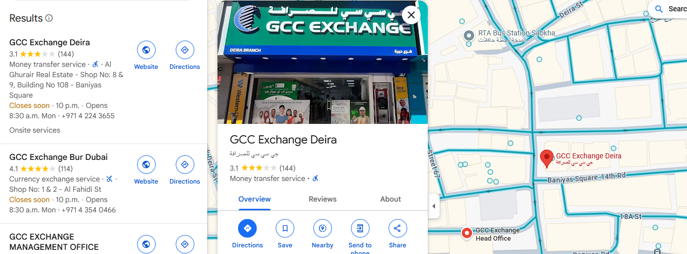
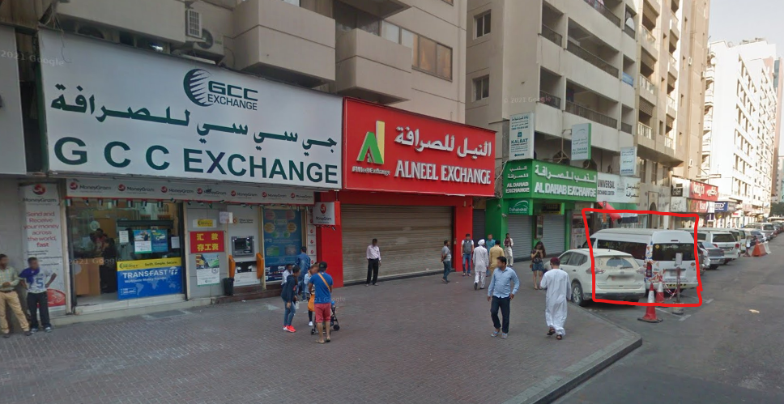
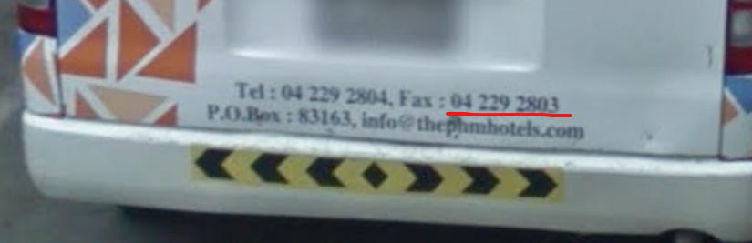

# OSINT 300-2 - Down Like This

## Challenge Description
A perfectly normal street in a perfectly mundane place for many people, but when I look at it, I see all these little details that cause it to differ from my own version of mundane. The script, the bikes left unsecured near what looks to be an ATM in broad view of the sidewalk (unlike the one next to it with a privacy screen), the format of the telephone numbers, and on and on... It looks exactly like scenes I have viewed many times, and in fact it is a place much like those places I've been. But it's those subtle differences - exotic spices on a familiar food.

The really incredible thing about living in our time is that we don't have to travel to see these things. We can go to a map and drop the little dude on the blue line and take a look around at (most) places in the world. But that's not it - we can not just see a place, but we can sometimes go back in time. See it how it was years ago.

If we went to this place, for example, we might see the comings and goings of people throughout time. Let's pay a little more attention to that. At one point, there was a white van parked on the street in front of this location. The license plate is obviously blurred, but the fax number on the back is not. That is your target. The archive below contains the flag. The password for this archive is the fax number on the back of the van parked in front of this location. Do not include spaces or special characters - just the numbers and all of the numbers you see there.

Right Click, Save As... [OSINT300-2.zip](https://pointeroverflowctf.com/static/OSINT300-2_flag.zip)

MD5 checksum 7137DDF0E8D4F33FF4CF568D2BCF052A

## Solution
I started off with reverse-searching this image on google images as it was a public building, and found the results narrowed down to a few buildings in Dubai, with the Deira branch being the closest fit with the image.

It was easy to find the location on google maps, and street view was available!

Locating the van took a little bit of trial and error with repositioning and changing the dates  to find it, but  I found eventually the van in December 2016's recorded street view.

Repositioning closer behind the van and zooming in, the fax number is 04 229 2803.

Entering **042292803** as the password for the archive revealed the flag.

## Flag
`poctf{uwsp_7h3_4n5w3r_70_3v3ry7h1n6}`