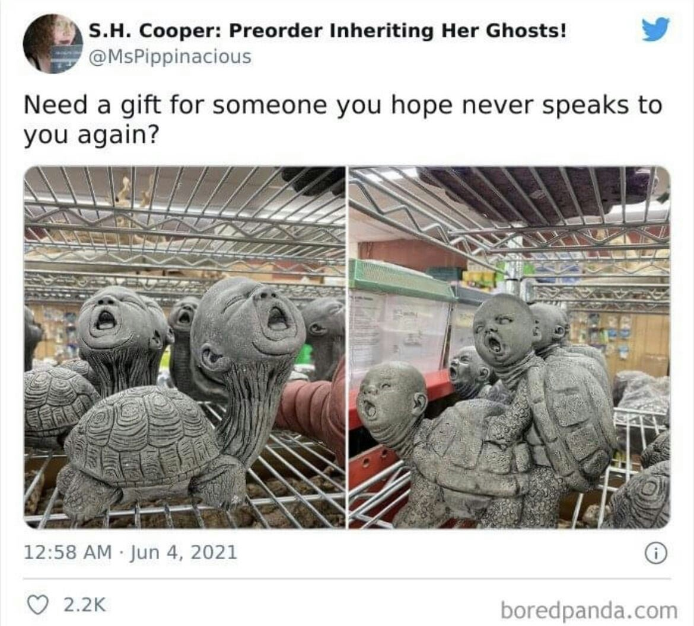

# OSINT 300-3 - Not All Secrets Are Exciting

## Challenge Description
Wasn't last year's multi-part OSINT challenge a blast? Let's do that again! Attached to this challenge is a VeraCrypt container. The password for this container is in three parts and you're going to need to do some searching to assemble them.

Let's start with this one. The first part of the password is the full name of the cat. Make sure it's capitalized to put some respect on it.

Add a dash (-) to separate the next part, which is the last name of the artist that makes these awesome sculptures. Make sure it's capitalized to put some respect on it. 

Add a dash (-) to separate the next part, which is the street number and five-digit zip code of the building where this picture was taken. For example, if the address is 1234 Main St. Nowhere, US 54321-4321 the solution would be 123454321. 

Right Click, Save As... [Capitalized To Put Some Respect On It](https://pointeroverflowctf.com/static/OSINT300-3)

MD5 checksum: F2FFA49768EA2D4F6A1FAB9852F1648D

## Solution

The first picture involved reverse-searching the image on google, and I found it was [Yuri Knorozov](https://en.wikipedia.org/wiki/Yuri_Knorozov). His cat's name was often referenced as "Asya", but her full name was "[Aspid](https://coleandmarmalade.com/2022/08/16/yuri-knorozov-credits-cat-asya-with-breakthrough/)."

The second picture involved some simple googling. After searching for "turtle statues with screaming baby heads", I found [this reddit post](https://www.reddit.com/r/HelpMeFind/comments/gbi8kl/creepy_turtle_baby_hybrid/) where a user commented the artist was [Jeff Galewood](https://www.instagram.com/jeff_galewood_sr/?hl=en).

In the third picture, I had to get a little creative with some photo editing. Reverse-searching this image did not bring up any leads, and the metadata was a dead-end, so I looked at all the visible text to see if there were any hints to the location. The card behind the laptop said "New York, New York", but that wasn't specific enough for finding the address as it could have meant the city in New York state. I saw same card next to the laptop, and after lowering the exposure, it says "New York, New York Las Vegas Hotel & Casino."

Searching the address on google, the address is **3790 S Las Vegas Blvd, Las Vegas, NV 89109**.
- Street number - 3790
- Zip Code - 89109
- Final number - 379089109

### Bringing everything together
Using all the information gathered, the password is **Aspid-Galewood-379089109**.

Opening the VeraCrypt container with the password revealed a txt file with the flag.

## Flag
`poctf{uwsp_411_7h3_b357_p30p13}`